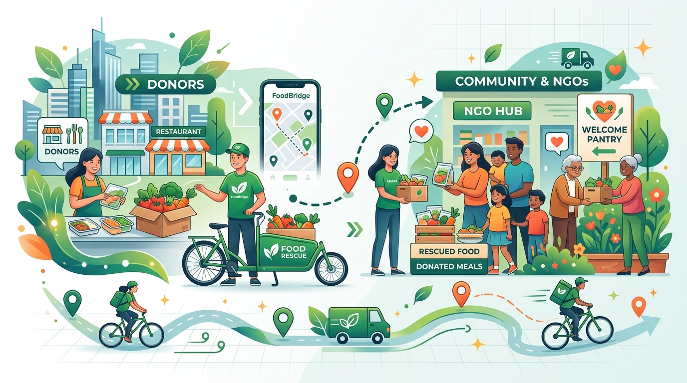
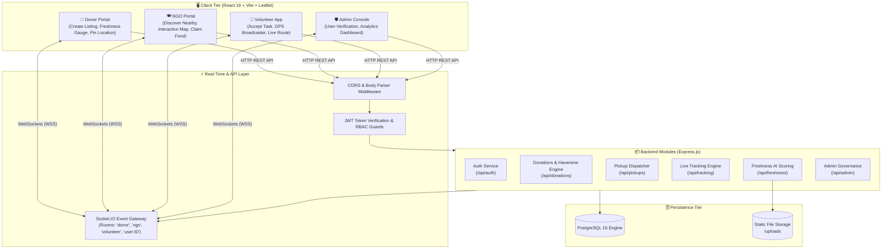
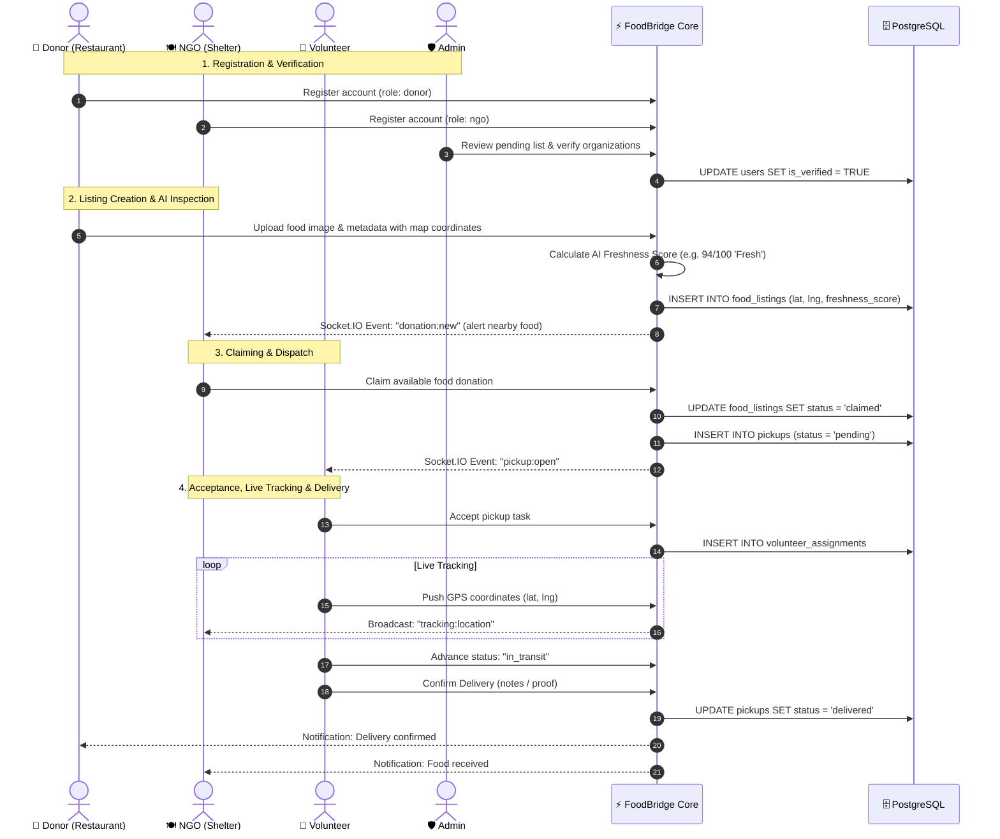
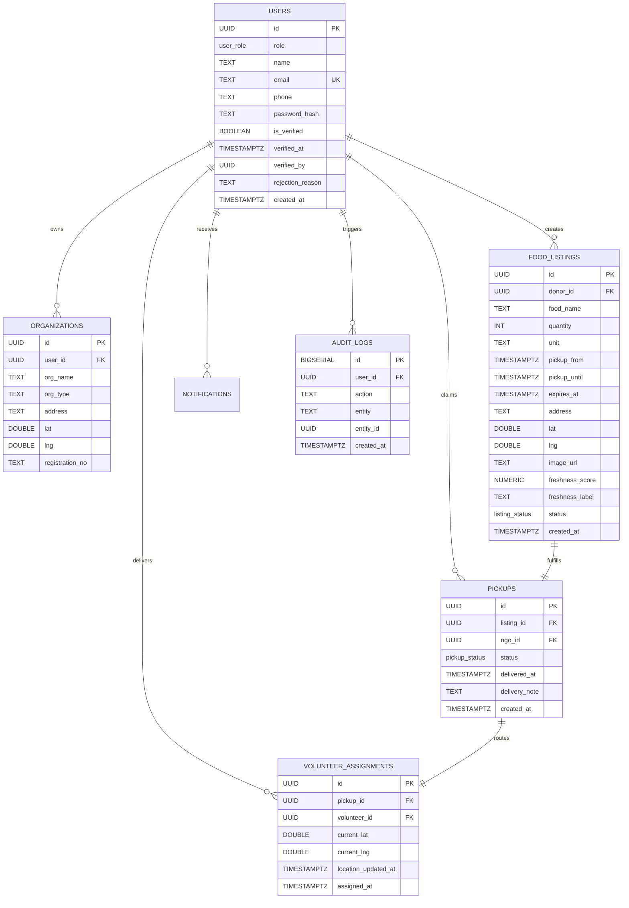

# 🍽️ FoodBridge

<div align="center">



### **Hyperlocal Real-Time Food Rescue & Surplus Redistribution Platform**

[](https://react.dev/)
[](https://vitejs.dev/)
[](https://nodejs.org/)
[](https://expressjs.com/)
[](https://www.postgresql.org/)
[](https://socket.io/)
[](https://leafletjs.com/)
[](https://www.docker.com/)

<p align="center">
  <a href="#-key-features"><b>Key Features</b></a> •
  <a href="#-system-architecture"><b>Architecture</b></a> •
  <a href="#-user-roles--lifecycle"><b>Lifecycle Flow</b></a> •
  <a href="#-database-schema"><b>Database</b></a> •
  <a href="#-quickstart-guide"><b>Quickstart</b></a> •
  <a href="#-api-documentation"><b>API Reference</b></a> •
  <a href="#-roadmap"><b>Roadmap</b></a>
</p>

</div>

---

## 📖 Overview

Every day, commercial kitchens, banquet halls, supermarkets, and restaurants discard metric tons of edible, high-quality surplus food due to logistical latency and fragmented communication. Concurrently, local orphanages, shelters, and community food banks struggle to fulfill basic daily nutritional needs.

**FoodBridge** is a modern, full-stack, real-time logistics platform designed to solve this last-mile coordination problem. By integrating:
1. **Interactive OpenStreetMap Geocoding** for precise pickup geofencing,
2. **Real-time Volunteer GPS Delivery Tracking** powered by bi-directional WebSocket channels,
3. **Centralized Administrative Verification** ensuring food safety and verified NGO legitimacy, and
4. **Computer Vision-Ready AI Freshness Scoring** to assess food safety before dispatch,

FoodBridge reduces the turnaround time from kitchen surplus to table delivery from hours to minutes.

---

## 🌟 Key Features

```
┌───────────────────────────────────────────────────────────────────────────┐
│                           FOODBRIDGE CORE SUITE                           │
├─────────────────────┬─────────────────────┬───────────────────────────────┤
│ 🗺️ Leaflet & OSM    │ 🚚 Real-Time GPS    │ 🛡️ Admin Verification         │
│ • Click-to-pin maps │ • Live courier ping │ • KYC / NGO accreditation     │
│ • Proximity search  │ • Stage progression │ • Audit trails & platform KPI │
│ • Free & open-source│ • ETA & delivery log│ • Fraud mitigation            │
├─────────────────────┴─────────────────────┴───────────────────────────────┤
│ 🧠 AI Freshness Score Engine                                              │
│ • Automated image capture & computer-vision scoring pipeline               │
│ • Confidence tiers: Fresh (85-99) • Good (65-84) • Okay • Wilted          │
│ • Real-time status badges with interactive freshness gauge                │
└───────────────────────────────────────────────────────────────────────────┘
```

### 1. 🗺️ Interactive Maps (Leaflet + OpenStreetMap)
- **Zero Cost, Zero API Quota**: Built with Leaflet and OpenStreetMap tile layers, requiring no proprietary API keys or paid billing tiers.
- **Location Picker**: Donors can click directly on the interactive map to place a pinpoint marker or allow browser geocoding.
- **Proximity-Based Discovery**: NGOs view listings plotted as interactive food markers with instant claim triggers.
- **Haversine Distance Filter**: Server-side trigonometric computation calculates accurate direct distances in kilometers.

### 2. 🚚 Real-Time Volunteer Delivery Tracking
- **Multi-Stage Delivery Progression**: Seamless progression through `pending` ➔ `assigned` ➔ `in_transit` ➔ `delivered`.
- **Live Geolocation Broadcasts**: Volunteers transmit GPS coordinates via high-precision device sensors, dynamically updating volunteer markers on donor and NGO dashboards without refreshing.
- **Proof of Delivery**: Delivery completion logs timestamps, volunteer attribution, and optional delivery notes.

### 3. 🛡️ Admin Governance & Verification
- **Safety & Quality Guard**: Unverified donors or NGOs cannot transact until verified by platform administrators.
- **One-Click Approval / Rejection**: Admins review credentials, contact details, and organization legitimacy with custom rejection reasoning.
- **Platform Analytics**: Real-time breakdown of user counts, active listings, fulfilled deliveries, and operational volume.

### 4. 🧠 AI Freshness Scoring
- **Automated Food Quality Evaluation**: Donors upload photos of surplus dishes during listing creation.
- **Quality Score Calculation**: MobileNet-compatible pipeline calculates an integrity score (0–99), categorical label, and confidence rating.
- **Transparency Gauge**: Both NGOs and drivers see an intuitive, color-coded circular gauge displaying food freshness prior to claiming.

---

## 🏛️ System Architecture



---

## 🔄 User Roles & Lifecycle Flow



---

## 📊 Database Schema



---

## 🚀 Quickstart Guide

### Prerequisites
- [Node.js](https://nodejs.org/) v18 or newer
- [Docker & Docker Compose](https://www.docker.com/) (recommended for PostgreSQL)
- [Git](https://git-scm.com/)

### 1. Clone & Setup Workspace
```bash
git clone https://github.com/trisharan07/FoodBridge.git
cd FoodBridge
```

### 2. Start PostgreSQL Database
```bash
# Spins up PostgreSQL 16 container with schema initialized
docker compose up -d

# Apply v2 migrations (maps, tracking, admin, freshness)
docker exec -i $(docker ps -qf "name=db") psql -U foodbridge foodbridge < database/migration_v2.sql
```

### 3. Start the Backend API
```bash
cd backend
cp .env.example .env
npm install
npm run dev
# Running on http://localhost:4000
```

### 4. Start the Frontend Application
```bash
cd ../frontend
npm install
npm run dev
# Running on http://localhost:5173
```

---

## 🧪 Interactive Multi-Role Testing Walkthrough

To experience the real-time synergy of FoodBridge, open **four distinct browser windows or private incognito tabs**:

| Window | Role | Credentials | Action |
|:------:|:----:|:-----------:|:-------|
| **Tab 1** | 🛡️ **Admin** | `admin@foodbridge.local` | Open **Admin Panel** to view statistics and approve pending users. |
| **Tab 2** | 🍱 **Donor** | `donor@restaurant.com` | Pick location on the map, upload an image for AI score, and list food. |
| **Tab 3** | 🍽️ **NGO** | `ngo@care.org` | Watch the real-time notification pop up, view the food on the map, and click **Claim**. |
| **Tab 4** | 🚴 **Volunteer** | `volunteer@rider.org` | See the open pickup, click **Accept**, click **Send GPS** to transmit live coordinates, and mark **Delivered**. |

---

## 📡 API Reference

### 🔐 Authentication (`/api/auth`)
| Method | Endpoint | Access | Description |
|:------:|:---------|:------:|:------------|
| `POST` | `/register` | Public | Register (`donor`, `ngo`, `volunteer`, `admin`) |
| `POST` | `/login` | Public | Authenticate and obtain JWT bearer token |

### 🍱 Food Listings (`/api/donations`)
| Method | Endpoint | Access | Description |
|:------:|:---------|:------:|:------------|
| `GET` | `/` | All Roles | Fetch active, non-expired listings |
| `GET` | `/nearby?lat=&lng=&radius=` | All Roles | Proximity search via Haversine distance formula |
| `POST` | `/` | Donor | Create surplus food donation with map coordinates |
| `POST` | `/:id/claim` | NGO | Atomically claim available listing |

### 📦 Pickups & Volunteers (`/api/pickups`)
| Method | Endpoint | Access | Description |
|:------:|:---------|:------:|:------------|
| `GET` | `/open` | Volunteer | Retrieve unassigned claimed pickups |
| `GET` | `/my-active` | Volunteer | List assignments actively in progress |
| `POST` | `/:id/accept` | Volunteer | Claim pickup assignment |
| `PATCH`| `/:id/advance` | Volunteer | Advance status (`assigned` ➔ `in_transit` ➔ `delivered`) |

### 🚚 Live Tracking (`/api/tracking`)
| Method | Endpoint | Access | Description |
|:------:|:---------|:------:|:------------|
| `POST` | `/:pickupId/location` | Volunteer | Transmit device GPS coordinates |
| `GET` | `/:pickupId/location` | Authenticated | Retrieve latest volunteer + pickup locations |
| `POST` | `/:pickupId/confirm-delivery` | Volunteer | Mark delivery complete with notes |
| `GET` | `/:pickupId/timeline` | Authenticated | Fetch comprehensive delivery timeline audit |

### 🧠 AI Freshness (`/api/freshness`)
| Method | Endpoint | Access | Description |
|:------:|:---------|:------:|:------------|
| `POST` | `/analyze` | Donor | Upload multipart food photo for freshness scoring |
| `GET` | `/score/:listingId` | Authenticated | Fetch computed freshness metrics for listing |

### 🛡️ Admin Verification (`/api/admin`)
| Method | Endpoint | Access | Description |
|:------:|:---------|:------:|:------------|
| `GET` | `/users/pending` | Admin | List accounts awaiting verification |
| `GET` | `/users` | Admin | Query all accounts with optional role filter |
| `POST` | `/users/:id/verify` | Admin | Approve and verify user account |
| `POST` | `/users/:id/reject` | Admin | Reject user account with recorded reason |
| `GET` | `/stats` | Admin | Aggregated platform operational metrics |

---

## 📁 Repository Structure

```
FoodBridge/
├── backend/
│   ├── src/
│   │   ├── middleware/
│   │   │   └── auth.js         # JWT verification & RBAC guard
│   │   ├── routes/
│   │   │   ├── admin.js        # Admin verification & KPI routes
│   │   │   ├── auth.js         # User registration & JWT auth
│   │   │   ├── donations.js    # Food listings & Haversine proximity
│   │   │   ├── freshness.js    # Multer upload & MobileNet bridge
│   │   │   ├── notifications.js# WebPush VAPID & SMS dispatcher
│   │   │   ├── pickups.js      # Assignment & status state engine
│   │   │   └── tracking.js     # OSRM turn-by-turn routing & live GPS
│   │   ├── services/
│   │   │   └── notificationService.js # WebPush & SMS integration
│   │   ├── db.js               # PostgreSQL pool connection
│   │   └── server.js           # Express setup + Socket.IO server
│   ├── uploads/                # Food imagery storage
│   └── package.json
│
├── frontend/
│   ├── public/
│   │   └── sw.js               # Service Worker for WebPush alerts
│   ├── src/
│   │   ├── App.jsx             # Unified SPA with role views & OSRM maps
│   │   ├── main.jsx            # React root mount
│   │   └── style.css           # Premium design tokens & responsive CSS
│   ├── index.html              # HTML5 entry with fonts & meta tags
│   ├── vite.config.js          # Vite config & API/Socket proxying
│   └── package.json
│
├── ml-service/                 # MobileNet AI Python Microservice
│   ├── app.py                  # Standalone classification HTTP microservice
│   ├── requirements.txt        # PyTorch, TorchVision, Pillow dependencies
│   └── Dockerfile              # Containerized ML inference runtime
│
├── database/
│   ├── schema.sql              # Initial 8-table relational schema
│   ├── migration_v2.sql        # v2 schema updates (tracking, admin, AI)
│   └── migration_v3.sql        # v3 schema updates (push subscriptions, SMS)
│
├── docs/
│   └── images/
│       └── banner.jpg          # FoodBridge visual illustration
│
└── docker-compose.yml          # PostgreSQL & MobileNet AI Microservice

```

---

## 🗺️ Roadmap & Milestones

- [x] **Core MVP**: JWT authentication, listing management, claim lifecycle.
- [x] **Maps & Geolocation**: Leaflet + OpenStreetMap integration with click-to-pin.
- [x] **Delivery Tracking**: Volunteer GPS pinging, real-time Socket.IO broadcasts.
- [x] **Admin Governance**: Verification workflows and system health analytics.
- [x] **AI Freshness Scoring**: Image analysis pipeline and visual status gauges.
- [x] **MobileNet Python Microservice**: Standalone classification microservice (`ml-service/`).
- [x] **Turn-by-Turn Route Optimization**: OSRM (Open Source Routing Machine) waypoint routing.
- [x] **Cloud Deployment**: AWS ECS / EC2 container deployment with Amazon RDS PostgreSQL & S3 bucket assets.
- [ ] **Continuous Integration (CI/CD)**: GitHub Actions workflow for automated testing & ECR build triggers.


---

## 📄 License & Attribution

Developed with ❤️ as an Engineering Final Year Project. Open-sourced under the [MIT License](LICENSE).
